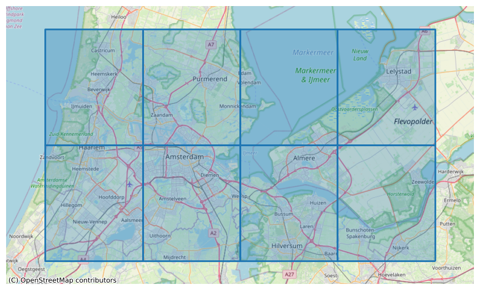
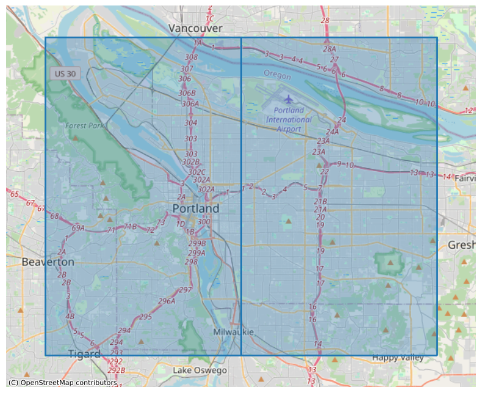
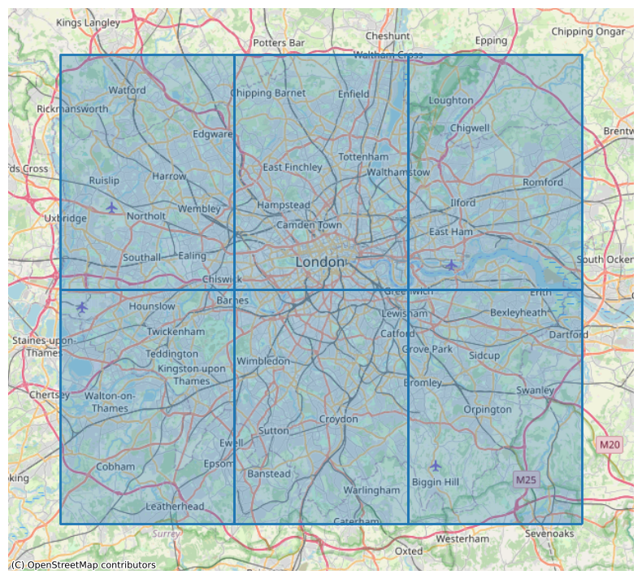

# Twitter Data Collection & Processing Summary

This document describes the data collection workflow, field definitions, and processing logic for a Twitter/X Academic Research dataset collected for **Amsterdam**, **Portland**, and **London** between **2013-01-01** and **2023-01-01**.  
For **Amsterdam** and **Portland**, the dataset also includes tweets from **2012**.  
Only **geo-located tweets** (tweets with location information falling inside predefined bounding boxes) were collected.

---

## 1. Data Collection Summary

Data was collected using the [Twitter/X Academic Research API](https://developer.x.com/en/use-cases/do-research/academic-research), accessed via the [Tweepy](https://www.tweepy.org/) Python package.

Queries were executed in **time intervals** and across predefined **geographical bounding boxes**, using Tweepy’s search endpoints with `tweet_fields`, `user_fields`, and `expansions`.

The collected API responses were transformed into CSV tables, enriching each tweet with user attributes, engagement metrics, and geolocation fields.

----

## 2. Geographic Bounding Boxes

Tweets were collected only if their geolocation information fell inside predefined bounding-box grids for each target city.  
Each bounding box follows the format: <min_lon> <min_lat> <max_lon> <max_lat>








### Amsterdam

```
4.511261 52.19919 4.77733625 52.3923595
4.511261 52.3923595 4.77733625 52.585528999999994
4.77733625 52.19919 5.0434115 52.3923595
4.77733625 52.3923595 5.0434115 52.585528999999994
5.0434115 52.19919 5.3094867500000005 52.3923595
5.0434115 52.3923595 5.3094867500000005 52.585528999999994
5.3094867500000005 52.19919 5.575562000000001 52.3923595
5.3094867500000005 52.3923595 5.575562000000001 52.585528999999994
```

### Portland

```
-122.806206 45.429781 -122.634716 45.625083
-122.634716 45.429781 -122.46322599999999 45.625083
```

#### London

```
-0.489 51.28 -0.24733333333333332 51.483000000000004
-0.489 51.483000000000004 -0.24733333333333332 51.68600000000001
-0.24733333333333332 51.28 -0.005666666666666653 51.483000000000004
-0.24733333333333332 51.483000000000004 -0.005666666666666653 51.68600000000001
-0.005666666666666653 51.28 0.23600000000000002 51.483000000000004
-0.005666666666666653 51.483000000000004 0.23600000000000002 51.68600000000001
```

---

## 3. API Fields Summary

During data collection, a broad set of Twitter/X Academic Research API fields was requested, covering tweet content, user metadata, engagement metrics, referenced tweets, and available geolocation information. These fields were used to enrich each collected tweet with detailed contextual and structural attributes.

Full field descriptions are available in the official X API data dictionary:  
https://docs.x.com/x-api/fundamentals/data-dictionary#tweet

---

## 4. Actual Columns in the Final Output

After processing and flattening the API responses, the dataset contains the following columns.

### Tweet-level fields

```
attachments
context_annotations
conversation_id
created_at
edit_controls
edit_history_tweet_ids
entities
geo_coo_coordinates
geo_coo_type
geo_loc_name
geo_place_id
id
in_reply_to_user_id
lang
possibly_sensitive
referenced_tweets
reply_settings
source
text
withheld
```


### Public metrics (tweet)

Flattened from `public_metrics → tweet_pm_*`:

```
tweet_pm_impression_count
tweet_pm_like_count
tweet_pm_quote_count
tweet_pm_reply_count
tweet_pm_retweet_count
```


### Author fields (prefixed with `author_`)

```
author_created_at
author_description
author_entities
author_id
author_location
author_name
author_pinned_tweet_id
author_profile_image_url
author_protected
author_url
author_username
author_verified
author_withheld
```


### Author public metrics (flattened from `author_public_metrics → author_pm_*`)

```
author_pm_followers_count
author_pm_following_count
author_pm_listed_count
author_pm_tweet_count
```


### Geo

```
geo_coo_coordinates
geo_coo_type
geo_loc_name
geo_place_id
```

---

## 5. Processing Pipeline

This section describes how raw API responses were converted into structured CSV files.

### Step-by-step summary

1. **Collect users from `includes.users`**  
   - For each API response, all users in `response.includes["users"]` are stored in a dictionary keyed by `user.id`.  

2. **Process each tweet in `response.data`**  
   For every tweet:
   - Convert the tweet object to a Python `dict`.
   - Attach the corresponding user information:
     - Add user fields with the prefix `author_*`.
     - Flatten `author_public_metrics` into `author_pm_*` columns.
   - Flatten tweet-level public metrics:
     - Expand `public_metrics` into `tweet_pm_*` columns.
   - Handle geolocation information:
     - If `geo` is present, flatten its keys into `geo_*` columns.
     - If `geo_coordinates` exists, further expand into `geo_coo_*` columns.
     - If `geo_place_id` exists, look up the place in `includes["places"]` and store the human-readable name in `geo_loc_name`.

3. **Handle media and polls**  
   - If `includes["media"]` is present, media items are collected into a separate `DataFrame` and saved as:
     - `{city}_media.csv`
   - If `includes["polls"]` is present, poll information is appended to a text file:
     - `{city}_polls`

5. **Sort columns alphabetically**  
   - Before saving, the tweet `DataFrame` columns are reindexed in alphabetical order.

6. **Write tweets to CSV**  
   - The final tweet-level dataset for each time interval is written to disk using the following path pattern:

   ```text
   {city}/tweets/{city}_{startDate}_{endDate}.csv˛```


---

## 6. Raw Data Statistics

The table below summarizes how many rows were loaded from the raw API outputs and how many were successfully parsed by pandas during CSV processing.

### Rows loaded (from data)

| City            | Raw rows      | Columns detected |
|-----------------|---------------|------------------|
| Amsterdam       | 18,138,337    | 41               |
| Portland        | 15,941,905    | 42               |
| Greater London  | 130,162,824   | 42               |


#### Totals

- **Total rows across all cities:** 164,243,066  
- **Total columns (union across all batches):** 42  
- **Rows stored in SQL:** 163,074,100  
- **Difference:** 1,168,966 (~0.99%)

---

7. Column-count Differences (39 vs 41 vs. 42)

- `tweet_pm_impression_count` added later best guess added later.
- Occasionally missing `withheld` and `author_withheld`.

---

9. Followers / Following Data Collection

Endpoints used:
https://docs.x.com/x-api/users/get-followers


https://docs.x.com/x-api/users/get-following

Preselected users from whole:

| City      | Follower/Following Rows |
| --------- | ----------------------- |
| London    | 190,368                 |
| Amsterdam | 20,471                  |
| Portland  | 18,682                  |

Unique Users

Total unique users: 228,078

Users appearing in ≥2 cities: 1,443


File coverage

| File type            | Count                           |
| -------------------- | ------------------------------- |
| GL follower files    | 166,116                         |
| GL following files   | 166,788                         |
| AMS follower files   | 469                             |
| OTHER follower files | 18,022 (Amsterdam consolidated) |

- sam table but with this numbers:
amsterdam followers files 18148

portland followers files 178

london followings files 166788

london followers files 166264

-- add good numbers from fix 

Portland follower data incomplete
Amsterdam partially incomplete
London partially incomplete


---

## 9. Followers / Following Data Collection

Follower and following relationships were collected using the official X API endpoints:

- https://docs.x.com/x-api/users/get-followers  
- https://docs.x.com/x-api/users/get-following  

Data was gathered for a **preselected set of users** derived from all tweets in the dataset.

---

### Preselected User Coverage

These are the total number of users selected per city:

| City      | Follower / Following Rows |
|-----------|----------------------------|
| London    | 190,368                    |
| Amsterdam | 20,471                     |
| Portland  | 18,682                     |

---

### Unique Users

- **Total unique users:** 228,078  
- **Users appearing in ≥ 2 cities:** 1,443  

---

### File Coverage Summary

| File type                 | Count       |
|---------------------------|-------------|
| Amsterdam follower files  | 18,148      |
| Portland follower files   | 178         |
| London following files    | 166,788     |
| London follower files     | 166,264     |

*Note:*  
- "Follower files" count the number of follower relationships recorded.  
- "Following files" count the users each selected account is following.

---

### Data Completeness Notes

- **Portland follower data is incomplete**  
  Only a very small number (178) follower relationships were retrieved.  
- **Amsterdam follower data is partially incomplete**   
- **London follower/following data is partially incomplete**  

---
